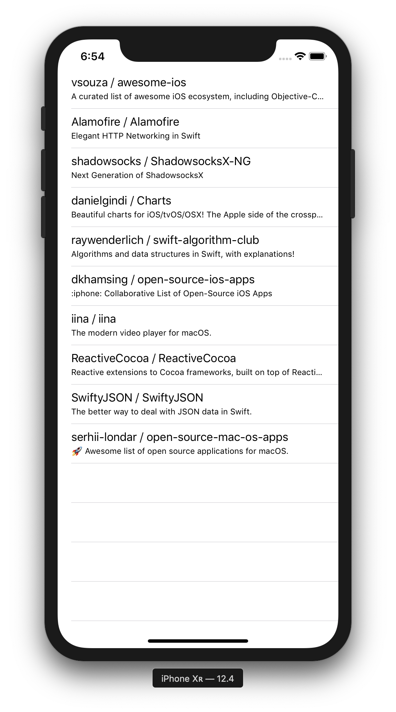
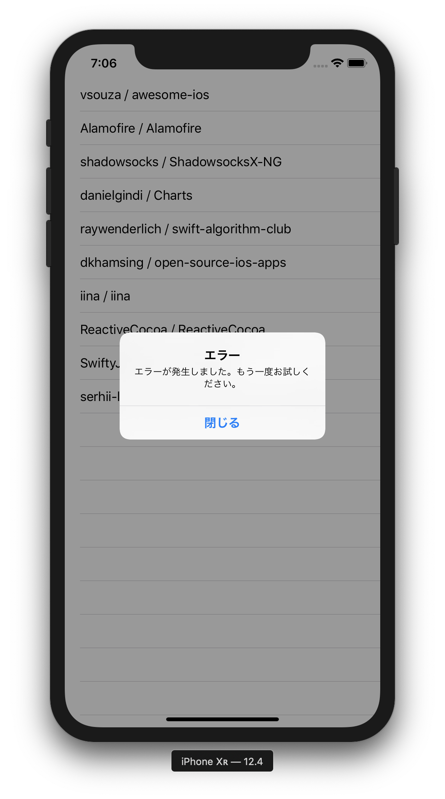
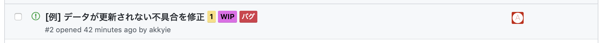
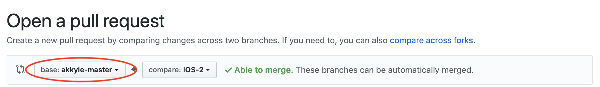
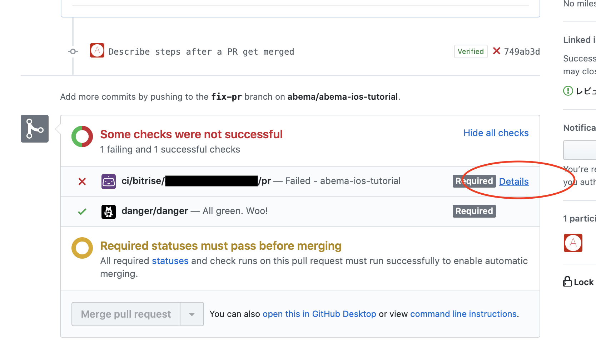
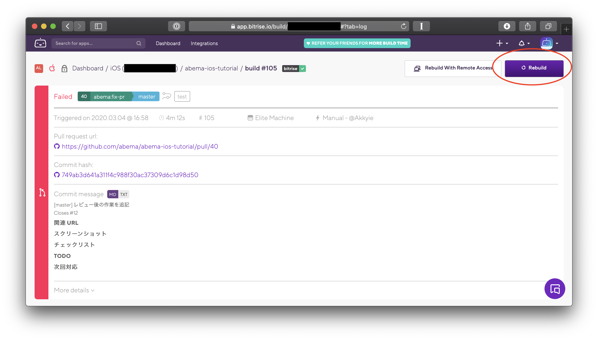

# ABEMA iOS Tutorial

## 概要

このプロジェクトは、ABEMA の iOS アプリ開発で用いられている開発環境やライブラリ、開発フローに慣れるためのサンプルプロジェクトです。

## 開発環境

- Xcode 11.3.x / Swift 5.1.x

### ツール

- [Homebrew](https://brew.sh) (推奨)
- [XcodeGen](https://github.com/yonaskolb/XcodeGen)
- [Carthage](https://github.com/Carthage/Carthage)
- [SwiftLint](https://github.com/realm/SwiftLint)

### ライブラリ

- [RxSwift](https://github.com/ReactiveX/RxSwift)
- [Unio](https://github.com/cats-oss/Unio)
- [Action](https://github.com/RxSwiftCommunity/Action)
- [RxOptional](https://github.com/RxSwiftCommunity/RxOptional)

ツールやライブラリの導入は [開発をはじめる](#開発をはじめる) を参考にしてください。

## チュートリアル

[チュートリアルの進め方](#チュートリアルの進め方) を参考に開発環境を整え、下記のタスクに取り組んでください。

### タスク 1.

master ブランチの実装には不具合があり、一部動作しない機能があります。

<kbd>⌘</kbd>+<kbd>U</kbd>でテストを実行すると、失敗している箇所があるはずです。

テストが通るように実装を修正してください。

### タスク 2.

- セルにリポジトリの説明文を追加してください。
- 追加したロジックについてのユニットテストを追加してください。



### タスク 3.

`APIClient`は、時々エラーを返します。

- エラーが返ってきたときにアラートを表示するようにしてください。
  - 文言の定義は導入済みの[SwiftGen](https://github.com/SwiftGen/SwiftGen)を用いてください。
- アラートを閉じたときに、データを再取得するようにしてください。
- 追加したロジックについてのユニットテストを追加してください。



### タスク 4.

- 以下の仕様を満たすお気に入り機能を実装してください、
  - セルか、セル上のボタンをタップしてお気に入りに追加/削除できるようにしてください。
    - 同じセルは一度のみお気に入りに追加できるようにしてください。
  - お気に入りに追加したリポジトリのみを表示する機能を追加してください。
    - 別のタブにするかフィルタを付けるかなど、表示方法は任意です。
  - アプリを再起動しても、お気に入りデータが消えないようにしてください。
    - 保存方法は任意です。
- Issue に仕様がある程度わかるような説明文を書いてください。
- 追加したロジックについてのユニットテストを追加してください。

## チュートリアルの進め方

### 開発をはじめる

#### プロジェクトのクローン

以下のコマンドで、本リポジトリを Clone できます。

```sh
$ git clone https://github.com/abema/abema-ios-tutorial-public.git
```

#### ツールのインストール

[brew.sh](https://brew.sh) に記載の手順に従って **Homebrew** をインストールしてください。

また、以下のコマンドで各種ツールをインストールしてください。

```sh
$ make brew-install
$ rbenv init # 表示される内容に従う
$ rbenv install
```

`make brew-install` によって実行されるコマンドの中身は、`Makefile` に書かれています。

#### ライブラリの取得・ビルド

以下のコマンドで、ビルドに必要なライブラリを取得できます。

```sh
$ make bootstrap
```

取得が終わったら、`AbemaTutorial.xcworkspace`を開いてプロジェクトを実行できるはずです。

#### 自分用の master ブランチを作成

チュートリアルに取り組む際は、**自分用の master ブランチ**を作成してください。

**例:**

```sh
$ git checkout -b akkyie-master master # <自分の名前>-master で作成してください
$ git push
```

### チュートリアルのタスクを進める

#### Issue を作成

[Issues](https://github.com/abema/abema-ios-tutorial/issues) から、自分が取り組むタスクについての **Issue**（チケット）を作成してください。
Issue には、以下の項目を記入・設定してください。

- **タイトル**: 取り組むタスクの内容を簡潔に記述してください。
- **説明文**: テンプレートを参考に、不具合の修正であれば**不具合の原因と対応**を、機能追加であれば**追加する機能の仕様**についてなるべくわかりやすく記述してください。
- **Asignees**: 自分を設定してください。
- **Labels**: 不具合の修正なら**バグ**、機能追加なら**機能追加**など、適切なラベルを設定してください。また、作業時間の見込み（見積もり）に応じて、`1` `3` `5` の中から適切なストーリーポイントを設定してください（おおよそ 1 ポイント＝ 1 営業日以内に完了するタスクです）。
- **Milestone**: 実装が完了する見込みのスプリントを設定してください。



#### Feature ブランチ を作成

実装は、自分用の master ブランチから切ったブランチ（**Feature ブランチ**）で行います。

Feature ブランチの名前は、 `IOS-<Issueの番号>` または `IOS-<Issueの番号>-<わかりやすい名前>` としてください。

**例:**

```sh
$ git checkout -b IOS-123-fix-layout akkyie-master
$ git push
```

#### Pull Request を作成

いくつかコミットを行ったら、作業中でも Pull Request を作成しましょう。

この時、**base ブランチが自分用の master ブランチになっていることを確認してください。**



Issue と同様に、Pull Request にも **Assignees**・**Labels**・**Milestone** を設定しましょう。また、作業中の Pull Request には必ず **WIP** (Work in progress) ラベルを付けましょう。

タイトルに `[WIP]` と入れたり、[Draft Pull Request](https://github.blog/jp/2019-02-19-introducing-draft-pull-requests/)にしたりするとより分かりやすいですが、これらは任意です。

#### Bitrise CI (Continuous Integration)

Pull Request を作成すると、自動的にそのブランチが Bitrise.io 上でビルド・テストされます。
もしビルドかテストのどちらかが失敗している場合、"Details" リンクから詳細を確認することができます。



追加でコミットをプッシュすると自動的に再ビルドされますが、手動で再実行したい場合は右上の "Rebuild" ボタンから行うことができます。



#### レビュー

実装が完了し、Bitrise 上でテストも通っていることが確認できたら、 WIP ラベルを外して **Reviewers** に自分のトレーナー（もしくはトレーナーが指定した誰か）を指定しましょう。
レビューを受けて修正する必要がある場合、もし修正に時間がかかりそうであれば、修正を行う旨をコメントして再度 WIP ラベルを付けた上で作業を行いましょう。

コードに修正を加える際は、なるべく force push を避けましょう。これは再度レビューしてもらうときに差分を分かりやすくするためです。
ただし、実装方法をまるっきり変える場合など、コミットを追加することでむしろ差分が見づらくなる場合は、force push して履歴を見やすくしてもよいです。

レビュー対応が終わって Approve されたら、自分でその PR をマージします。
PR をマージしたら、対応する Issue も合わせてクローズしましょう。
